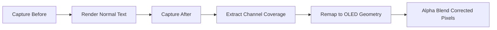

<p align="center">
  
</p>

<h1 align="center">PureType</h1>

<p align="center">
  <strong>OLED-aware subpixel text rendering for Windows</strong><br/>
  <em>Sharper, cleaner text on LG WOLED and Samsung QD-OLED displays.</em>
</p>

<p align="center">
  
  
  
</p>

<p align="center">
  <a href="https://www.patreon.com/Puretype">
    
  </a>
  <a href="https://paypal.me/masterantonio">
    
  </a>
</p>

<p align="center">
  <a href="https://discord.gg/c2U8QbHzv9">Discord</a> |
  <a href="#quick-start">Quick Start</a> |
  <a href="#supported-panels">Supported Panels</a> |
  <a href="#reporting-issues">Report an Issue</a>
</p>

---

> [!CAUTION]
> **Repository scope**
> PureType has moved to a closed-source development model.
> This public repository is the official hub for:
> - downloading releases
> - reading documentation
> - tracking community issues

---

## IMPORTANT PROJECT UPDATE (APRIL 2026)

> [!WARNING]
> **PureType is at a critical point.**
> For months, I worked on this project every day, often more than 12 hours per day while also keeping a full-time job.
>
> During this period, I also faced constant attacks, insults, and even stalking about my real skills. 
>
>I love this app and strongly believe in its value, but I reached a breaking point and I am genuinely exhausted.
>
> **To keep PureType alive and continue delivering new releases, supporter funding is now required.**
>
> Starting today, access to new releases requires support through Patreon or PayPal.
>
> - Patreon: https://www.patreon.com/Puretype
> - PayPal (preferred, lower platform fees): https://paypal.me/masterantonio
>
> Thank you from the bottom of my heart for your support and understanding.

---

## At a Glance

| What it is | Who it is for | Main benefit |
|---|---|---|
| A Windows text-rendering enhancement layer for OLED panel layouts | Users with LG WOLED or Samsung QD-OLED monitors | Reduced color fringing and cleaner perceived text edges |

---

## Why PureType Exists

ClearType was designed in 2000 for RGB-stripe LCD panels.

Modern OLED displays use different subpixel geometries:

- **WOLED** includes a fourth **white** subpixel that ClearType does not model.
- **QD-OLED** uses a **triangular** subpixel arrangement with a half-pixel vertical row offset.

With stock ClearType, these layouts can produce visible color fringing and luminance haze.

PureType intercepts GDI and DirectWrite text rendering, extracts per-channel coverage, and remaps it to the physical subpixel layout of your panel.

Subpixel center positions are derived from **panel microscopy** (macro captures with isolated subpixels), not simple geometric assumptions.

---

## Supported Panels

| Panel type | Examples | `panelType` value |
|---|---|---|
| LG WOLED RWBG | LG 27GR95QE, 45GR95QE, C-series OLED TVs used as monitors | `rwbg` |
| LG WOLED RGWB | LG 32" OLED models (PG32UCDP, 32GS95UE, ...) | `rgwb` |
| Samsung QD-OLED Gen 1-2 | Dell AW3423DW / AW3423DWF, Odyssey G8 OLED 34" Gen 1, Odyssey Neo G9 OLED | `qd_oled_gen1` |
| Samsung QD-OLED Gen 3 | Odyssey G8 OLED 27" QHD, Dell AW2725DF, 32" 4K models | `qd_oled_gen3` |
| Samsung QD-OLED Gen 4 | MSI MPG 272URX, 27" 4K UHD models 2024-2025 | `qd_oled_gen4` |

> [!TIP]
> **Not sure about QD-OLED generation?**
> - Oval or teardrop subpixels, red clearly larger than blue: **Gen 1-2**
> - Rectangular subpixels, red slightly wider than blue: **Gen 3**
> - Rectangular subpixels, red and blue almost equal size: **Gen 4**

---

## Quick Start

1. Download the latest `.zip` from the **Releases** tab.
2. Extract it to a permanent folder, for example `C:\PureType\`.
3. Run `puretype.exe` (it starts minimized in the system tray).
4. Double-click the tray icon to open the UI.
5. Select your panel type and a quick preset (**Balanced**, **Sharp**, or **Clean**).
6. Click **Save and Apply**.

> [!NOTE]
> PureType disables Windows ClearType while active and restores it on exit.

---

## Graphical Interface (UI Guide)

PureType includes a WPF-based UI (`PuretypeUI.exe`, .NET 9) with sidebar navigation and a live preview.

| Tab | Purpose |
|---|---|
| **Overview** | Live before/after preview, quick preset chips, active configuration summary |
| **Rendering** | Panel type, filter strength, WOLED crosstalk reduction, gamma mode and correction, OLED gamma output, luma contrast, subpixel hinting, fractional positioning, stem darkening |
| **Display** | LOD glyph-size thresholds, high-DPI fade-out thresholds |
| **System Font** | Install/restore bundled **Inter** variable font as system UI font; adjust weight, optical size, and spacing with live preview |
| **Profiles** | Per-monitor and per-application override profiles |
| **Settings** | Start with Windows, debug logging, glyph highlight overlay, process blacklist |
| **Info** | Version, author, GitHub and donation links, license |

---

## Manual Configuration and Profiles

All settings are stored in `puretype.ini` (same directory as the DLL).

You can configure using the UI or edit the INI directly.

Changes are applied after:

- clicking **Save and Apply** in the UI, or
- tray menu: **Disable** then **Enable**

### Profile precedence

```text
App profile -> Monitor profile -> Global ([general])
```

Use the **Profiles** tab for easier management of overrides.

---

## How It Works

PureType hooks `ExtTextOutW` (GDI) and DirectWrite draw calls.

For each text draw:

1. Capture target region before draw.
2. Let renderer draw normally (layout and metrics remain unchanged).
3. Capture region after draw.
4. Extract per-channel coverage from before/after delta.
5. Remap coverage to physical OLED subpixel positions.
6. Blend corrected pixels back with per-pixel alpha.



---

## Compatibility

| Framework / Renderer | Status |
|---|---|
| Win32 / MFC / WinForms | Supported |
| Qt5 / Qt6 (EqualizerAPO, Peace, VoiceMeeter, ...) | Supported |
| WPF with GDI fallback | Supported |
| CJK IME (Microsoft IME, ATOK, ...) | Supported |
| Notepad / Notepad++ | Supported |
| Legacy 32-bit apps | Supported |
| DirectWrite + Direct2D | Supported |
| System ClearType off | Supported |
| Composited/layered windows (desktop icon labels) | Supported |
| UWP / AppContainer processes | Supported (ACL permissions granted automatically) |

You can customize exclusions through **Settings -> Process Blacklist** or directly in `puretype.ini`.

---

## Reporting Issues

Use GitHub issue templates in this repository:

- **Bug report**: wrong colors, invisible text, ghost characters, crashes
- **Feature request**: new options, new rendering behaviors
- **Panel compatibility**: new panel type or microscopy data

### Bug report checklist

1. Attach `puretype.ini`
2. Enable debug logging in `puretype.ini`:

   ```ini
   [debug]
   enabled = true
   ```

3. Reproduce the issue
4. Attach generated `PURETYPE.log`

---

## License

**Copyright (c) 2026-2027 Antonio (Toriga). All rights reserved.**

PureType is proprietary software for personal use.
You may not reverse engineer, decompile, modify, or distribute this software commercially without permission.
See [LICENSE](LICENSE) for full terms.

---

<p align="center">
  <strong>Support PureType:</strong><br/>
  <a href="https://www.patreon.com/Puretype">Patreon</a> |
  <a href="https://paypal.me/masterantonio">PayPal</a><br/>
  <strong>Author:</strong> <a href="https://github.com/Master-Antonio">Toriga</a>
</p>
