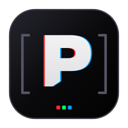

  

<h1 align="center">PureType</h1>

  <strong>OLED-aware subpixel text rendering for Windows</strong> 
  <em>Sharper, cleaner text on LG WOLED and Samsung QD-OLED displays.</em>

  
  
  

  
  

  <a href="https://discord.gg/c2U8QbHzv9">Discord</a> |
  <a href="#quick-start">Quick Start</a> |
  <a href="#supported-panels">Supported Panels</a> |
  <a href="#reporting-issues">Report an Issue</a>

---

> [!IMPORTANT]
> **Project Status & Licensing Notice**
> 
> PureType has transitioned to a closed-source development model to ensure the long-term sustainability of the project. 
> 
> **Access to new releases and updates now requires an active supporter subscription via Patreon or a one-time contribution via PayPal (which will be manually converted into a Patreon subscription).**
>
> **Notice on Legacy Code:** Previous open-source versions of this project were released under the **GNU General Public License v3.0 (GPLv3)**. Anyone using, modifying, or distributing that legacy codebase is legally required to adhere strictly to the GPLv3 terms. This includes the mandatory requirement that any derivative works or modified versions based on that code must also be made completely open-source under the GPLv3 license and clearly state the original authorship.

---

## At a Glance

| What it is | Who it is for | Main benefit |
|---|---|---|
| A Windows text-rendering enhancement layer for OLED panel layouts | Users with LG WOLED or Samsung QD-OLED monitors | Reduced color fringing and cleaner perceived text edges |

---

## Why PureType Exists

Windows ClearType was designed in 2000 for standard RGB-stripe LCD panels. Modern OLED displays use entirely different subpixel geometries:

* **WOLED:** Includes a fourth **white** subpixel that ClearType does not model.
* **QD-OLED:** Uses a **triangular** subpixel arrangement with a half-pixel vertical row offset.

Using stock ClearType on these layouts produces visible color fringing and luminance haze. PureType intercepts GDI and DirectWrite text rendering, extracts per-channel coverage, and remaps it to the physical subpixel layout of your specific panel. 

Subpixel center positions are derived from **panel microscopy** (macro captures with isolated subpixels) for maximum accuracy.

---

## Supported Panels

| Panel type | Examples | `panelType` value |
|---|---|---|
| LG WOLED RWBG | LG 27GR95QE, 45GR95QE, C-series OLED TVs used as monitors | `rwbg` |
| LG WOLED RGWB | LG 32" OLED models (PG32UCDP, 32GS95UE, ...) | `rgwb` |
| Samsung QD-OLED Gen 1-2 | Dell AW3423DW / AW3423DWF, Odyssey G8 OLED 34" Gen 1, Odyssey Neo G9 OLED | `qd_oled_gen1` |
| Samsung QD-OLED Gen 3 | Odyssey G8 OLED 27" QHD, Dell AW2725DF, 32" 4K models | `qd_oled_gen3` |
| Samsung QD-OLED Gen 4 | MSI MPG 272URX, 27" 4K UHD models 2024-2025 | `qd_oled_gen4` |

> [!TIP]
> **Not sure about your QD-OLED generation?**
> * Oval or teardrop subpixels, red clearly larger than blue: **Gen 1-2**
> * Rectangular subpixels, red slightly wider than blue: **Gen 3**
> * Rectangular subpixels, red and blue almost equal size: **Gen 4**

---

## Quick Start

1. Download the latest `.zip` release.
2. Extract it to a permanent folder (e.g., `C:\PureType\`).
3. Run `puretype.exe` (it starts minimized in the system tray).
4. Double-click the tray icon to open the User Interface.
5. Select your specific panel type and choose a quick preset (**Balanced**, **Sharp**, or **Clean**).
6. Click **Save and Apply**.

*Note: PureType temporarily disables Windows ClearType while active and restores it automatically upon exit.*

---

## Graphical Interface (UI Guide)

PureType includes a modern WPF-based UI (`PuretypeUI.exe`) featuring live previews and deep customization:

* **Overview:** Live before/after preview, preset selection, and active configuration summary.
* **Rendering:** Panel selection, filter strength, WOLED crosstalk reduction, gamma settings, luma contrast, subpixel hinting, fractional positioning, and stem darkening.
* **Display:** LOD glyph-size thresholds and high-DPI fade-out parameters.
* **System Font:** Install/restore the bundled **Inter** variable font as the system UI font.
* **Profiles:** Manage per-monitor and per-application override profiles.
* **Settings:** Autostart configuration, debug logging, and process blacklisting.

---

## Compatibility

PureType is highly compatible across modern and legacy Windows environments:

| Framework / Application | Status |
|---|---|
| Win32 / MFC / WinForms | Supported |
| Qt5 / Qt6 | Supported |
| WPF (with GDI fallback) | Supported |
| DirectWrite + Direct2D | Supported |
| UWP / AppContainer | Supported (ACL permissions granted automatically) |
| System ClearType off | Supported |

*You can customize exclusions through **Settings -> Process Blacklist** or directly in `puretype.ini`.*

---

## Reporting Issues

If you encounter bugs (e.g., wrong colors, ghost characters, crashes) or wish to request support for a new panel layout, please use the issue tracker in this repository. 

**When reporting a bug, please include:**
1. A description of the issue and steps to reproduce.
2. Your `puretype.ini` file.
3. Your `PURETYPE.log` file (enable debug logging in the settings before reproducing the issue).

---

## License & Copyright

**Copyright &copy; 2026-2027 Antonio (Toriga). All rights reserved.**

The current versions of PureType are **proprietary software**. You may not reverse engineer, decompile, modify, or distribute this software without explicit permission. 

*Legacy open-source versions remain under the **GPLv3** license. Any utilization, modification, or distribution of that legacy code must fully comply with all GPLv3 terms.*

---

  <strong>Author:</strong> <a href="https://github.com/Master-Antonio">Toriga</a> 
  Thank you for supporting independent development.

